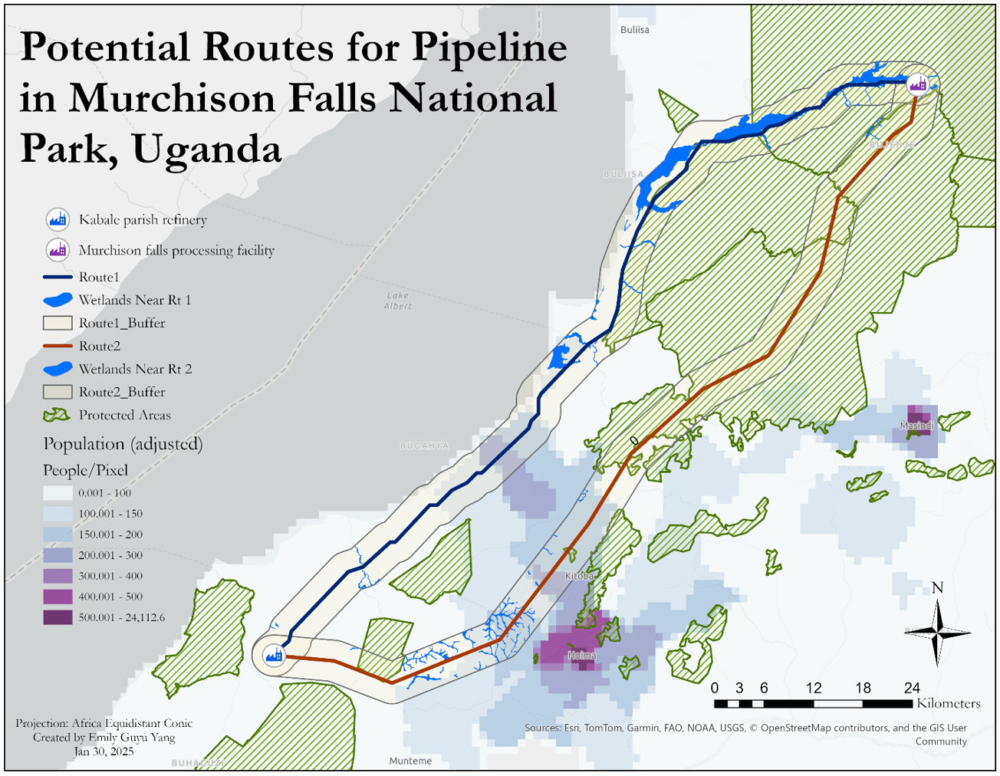

## Hi there 👋

My name is Emily and I am a second-year Master of Environmental Management student at Duke University, focusing on analytics & modeling and geospatial analysis. 
<!--
**emily-gy/emily-gy** is a ✨ _special_ ✨ repository because its `README.md` (this file) appears on your GitHub profile.

Here are some ideas to get you started:

 I’m currently working on ...
- 🌱 I’m currently learning ...
- 👯 I’m looking to collaborate on ...
- 🤔 I’m looking for help with ...
- 💬 Ask me about ...
How to reach me: ...
- 😄 Pronouns: ...
- ⚡ Fun fact: ...
-->

- 🔭 I am working on projects using GIS & remote sensing tools to help informed decision-making

- 🌱 I use R, Python, ArcGIS Pro, Google Earth Engine, Google Earth Pro, and ENVI

- 📫 You can reach me on [LinkedIn](https://www.linkedin.com/in/emily-guyu-yang/) or by email at emily.yang@duke.edu

